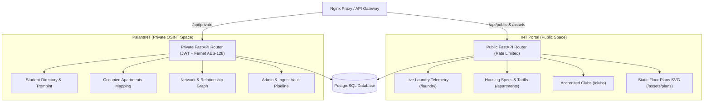

# PalantINT & INT Portal — Technical Architecture & Deep AI Context

Dernière mise à jour : 2026-07-22 (Architecture bicipale, Mermaid Diagram & Separation Public/Privé)

## 👁️ Vision & Architecture à Deux Espaces

Le projet unifie deux applications distinctes partageant un backend FastAPI et une base de données PostgreSQL 16 commune :



## 🏛️ INT Portal (Espace Public)

### Rôle & Vision
Le portail citoyen tout-en-un accessible librement par tous les étudiants, intervenants et visiteurs du campus **IMT-BS / Télécom SudParis** sans aucune authentification requise.

### Design System & Esthétique
* **Palette** : Warm Ivory & Sand (`bg-stone-50` / `bg-stone-900` en mode sombre).
* **Fond dynamique** : Motif pointillé vectoriel discret (`radial-gradient`) superposé à un dégradé doux d'arrière-plan.
* **Header & Shell** : Barre sticky translucide avec logo d'icône `Layers`, basculeur de thème persistent (`ThemeToggle`), et footer minimaliste à filigrane géant `INT PORTAL`.
* **Zero Flash SSR** : Script bloquant synchrone injecté dans le `<head>` de `layout.tsx` empêchant tout clignotement de thème lors du rendu côté serveur.

### Modules Publics Principaux
1. **Accueil (`/`)** : Hero section épurée avec grille éditoriale en 3 colonnes égales (Clubs, Logements, Laverie).
2. **Moniteur de Laverie (`/laundry`)** : Suivi télémetrique en temps réel des machines à laver (mal) et séchoirs (sl) sur les bâtiments U3 à U7 via `/api/laundry/{building}`.
3. **Répertoire du Logement (`/apartments`)** : Catalogue interactif des chambres Maisel (surfaces en m², tarifs de base, calculs boursier/non-boursier, critères PMR) via `/api/students/apartments/details`.
4. **Annuaire des Associations (`/clubs`)** : Répertoire classé par association parente (BDE, BDA, ASINT...) avec tiroir modal de détails et bouclier de protection de la vie privée (`ShieldAlert`).

## 👁️ PalantINT (Espace Privé OSINT)

### Rôle & Vision
Plateforme d'analyse, d'administration et de cartographie haute précision réservée aux opérateurs et administrateurs autorisés.

### Design System & Esthétique
* **Palette** : Luxe Professionnel Brutaliste (Zinc-950, néons sombres, DataGrids haute densité).
* **Interactivité & WebGL** : Jumeau numérique 3D (`BuildingModel`) via Three.js pour le rendu 3D des bâtiments résidentiels. Manipulation directe du DOM (DOM Refs + `setAttribute`) pour les cartes SVG afin de bypasser le cycle React et garantir 60FPS.

### Modules Privés Principaux
1. **Annuaire Etudiant & Trombinoscope** : Recherche globale avec photos de profil (`/students/{id}/image`).
2. **Occupants des Logements (`/palantint/apartments`)** : Cartographie nominative associant chaque numéro de chambre à l'identité de son étudiant occupant (`/students/apartments/occupied`).
3. **Graph & Relations (`/palantint/network`)** : Graphe des liens d'amitié, promo et associations (`StudentRelationship`).
4. **Système de Notifications (`/notifications/laundry/subscribe`)** : Alarmes automatiques de libération de machines réservées aux utilisateurs connectés.
5. **Panneau Administration (`/palantint/admin`)** : Ingestion de données, gestion du Vault et calibrations de cartes (`MapMetadata`).

## 🛡️ Séparation Strictement Imposée Backend (Public / Private)

Le backend FastAPI (`backend/src/main.py`) sépare hermétiquement les deux contextes :

### Routes Publics (`public_router`, pas d'auth)
* **Endpoints** : `/clubs`, `/class-groups`, `/laundry/{building}`, `/students/apartments/details`, `/assets/*`.
* **Garantie** : Protégés par rate-limiting (`rate_limit_dep`). **Aucune PII (Personally Identifiable Information)** n'est retournée. Les listes de membres, photos d'étudiants et informations nominatives en sont strictly exclues.

### Routes Privées (`private_router`, auth requise)
* **Endpoints** : `/private/users/*`, `/private/students/occupied`, `/private/notifications/*`, `/private/admin/*`.
* **Garantie** : Injection obligatoire de la dépendance JWT `require_user_query_token`. Chiffrement symétrique **Fernet (AES-128)** pour le stockage sécurisé des identifiants CAS.

## 🏗️ Architecture Technique & Pipeline ETL

### 🐍 Backend : FastAPI & SQLModel
* **Architecture** : REST API Asynchrone.
* **Modèles** : SQLModel (SQLAlchemy + Pydantic v2) dans `backend/src/db/models.py`.
* **Migrations** : Alembic pour le versioning du schéma PostgreSQL 16.
* **Sécurité** : JWT + Fernet (AES-128).

### ⚛️ Frontend : Next.js 15
* **Moteur** : React 19 + App Router (sous-module Git `INT-Scripts/palantint-frontend`).
* **WebGL** : Three.js pour le rendu 3D des bâtiments résidentiels.
* **Styles** : Tailwind CSS 4. Mode sombre brutaliste sur Zinc-950 pour PalantINT, Warm Ivory & Sand pour INT Portal.

### 🛠️ Scripts & Pipeline ETL (Synchronisation)
* **Harvest (Scrapers)** : Extraient les données brutes (Trombi, Agenda, MiNET) vers JSON dans `data/scraps/auto/` (les données manuelles étant dans `data/scraps/manual/`). *Indépendants de la base de données.*
* **Ingest (Loaders)** : Synchronisent les JSON vers PostgreSQL. Gèrent la fusion (Merge) des données web avec les identités locales.
* **Vault (Backup)** : Système de sauvegarde portable dans `data/exports/`. Archive la recherche manuelle (Relations, Socials, Notes) et les calibrations de cartes.
* **TUI** : Interface interactive CLI via `questionary` et `rich`.

## 🗃️ Modèle de Données & Lifecycles

Schéma complet (24 tables) : `backend/src/db/models.py`. Le principe directeur : une seule
table d'identité (`Person`) et une seule hiérarchie d'organisations/lieux (`Organization`,
`Location`), avec la **provenance** (qui a écrit cette donnée, et quand) portée par le schéma
lui-même plutôt que par l'ordre d'exécution des loaders.

### 0. Provenance & Ingestion Governance
* **Tables** : `DataSource` (registre des systèmes sources — `trombint`, `agenda_ade`, `maisel`,
  `groupes`, `clubs`, `vault_manual`, `admin_panel`), `IngestionRun` (journal d'audit : un run par
  invocation de loader, avec statut/compteurs/erreur).
* **Handling** : Toute ligne hydratée automatiquement porte un `source_id` vers son `DataSource`.
  C'est ce champ (et non plus l'ordre "vault restauré en dernier") qui garantit qu'un scrape
  n'écrase jamais une donnée manuelle — voir §2.

### 1. Identity Core (Person)
* **Table** : `Person` (`kind` : STUDENT / PROFESSOR / ALUMNUS / STAFF / EXTERNAL). Remplace
  l'ancien `Student` — l'identité n'est plus câblée sur une seule source.
* **Identifiants externes** : `ExternalIdentity` (`person_id`, `source_id`, `external_id`) —
  un `Person` peut avoir un identifiant TrombINT, un login CAS, etc., sans jamais toucher à
  `people`.
* **Rattachements** : `OrganizationMembership` (école, promo, classe, club, bureau — voir §3) et
  `PersonHousing` (logement, voir §4) portent tous deux `started_at`/`ended_at` : une synchro
  **clôture** les rattachements obsolètes (`ended_at`) au lieu de les supprimer, pour préserver
  l'historique.

### 2. Human Intelligence (OSINT Research)
* **Tables** : `SocialLink`, `PersonRelationship`, `Media` (Comms Log).
* **Handling** : Données créées par l'utilisateur. **Cruciales.** Protégées par le Vault
  (`data/exports/`), restauré via `source_id = vault_manual` et (pour `PersonRelationship`) un
  `confidence` (CONFIRMED/LIKELY/UNCONFIRMED) — la garantie "jamais écrasé par un scrape" tient
  du fait qu'aucun scraper n'écrit dans ces tables, pas d'un ordre d'exécution particulier.

### 3. Organizations (Schools, Promos, Class Groups, Clubs, Labs, Companies…)
* **Table** : `Organization`, arbre auto-référentiel (`parent_id`). `kind` : SCHOOL / PROGRAM /
  PROMO / CLASS_GROUP / CLUB / BUREAU / LAB / COMPANY. Remplace `Club`/`ClassGroup` et
  l'inférence par regex qui reconstruisait toute la hiérarchie à chaque synchro — l'arbre est
  maintenant construit une fois (upsert idempotent par niveau) puis seules les
  `OrganizationMembership` sont resynchronisées.
* **Handling** : Hydratation web. Si un sujet disparaît du web, il est marqué `is_active: false`
  pour préserver ses notes OSINT.

### 4. Locations (Buildings, Floors, Rooms, Apartments, Laundry Slots)
* **Table** : `Location`, arbre auto-référentiel (`parent_id`). `kind` : BUILDING / FLOOR / ROOM /
  APARTMENT / MACHINE_SLOT / COMMON_AREA. Unifie ce qui était quatre représentations libres
  différentes (`ApartmentDetail`, `AgendaEvent.room`, `MapMetadata.building_id/floor_id`,
  `LaundrySubscription.building/machine_nbr`).
* **Handling** : Champs spécifiques au `kind` (surface/prix pour un APARTMENT, type de machine
  pour un MACHINE_SLOT…) dans `Location.attributes` (JSON) plutôt que des colonnes dédiées.

## 📟 Manuel d'Exploitation

### Installation & CLI
```bash
# Dans PalantINT/scripts
uv sync
uv run palantint # Interface interactive TUI
```

### Mandat de Langage
Toute interaction avec l'utilisateur (Web ou CLI) doit utiliser un **Langage Naturel Professionnel**. 
* ❌ "Deploy Operative", "Extraction Velocity", "ID_REF"
* ✅ "Ajouter un membre", "Vitesse de téléchargement", "Identifiant"

## 📂 Structure des Dossiers & Contrats de Données

```
data/
├── exports/              ← 🔒 Vault (données utilisateur/OSINT persistantes : maps.json, etc.)
├── assets/               ← 🎨 Ressources statiques web (plans SVG transformés, 3D tiles, logos)
└── scraps/               ← 📦 Données sources (découplées en auto/ et manual/)
    ├── auto/             ← 🤖 Données scrapées / générées par scripts
    │   ├── agenda/       ← Emplois du temps JSON (agenda.py)
    │   ├── clubs.json    ← Liste des associations (clubs.py)
    │   ├── groupes.json  ← Appartenance aux promotions/groupes (groupes.py)
    │   ├── logements.json← Fiches techniques chambres Maisel (maisel.py)
    │   ├── students.json ← Annuaire étudiant trombi (trombint.py)
    │   └── processing_temp/ ← Cache temporaire d'extraction 3D
    └── manual/           ← ✍️ Données sources fournies manuellement
        ├── apartments.csv / txt ← Référentiel des chambres
        ├── foyer_map.csv  ← Mapping salles/associations Foyer
        ├── input_svgs/   ← Dessins vectoriels bruts des plans (.svg)
        ├── input_gltf/   ← Modèles 3D bruts (.gltf.zip)
        ├── metadata/     ← Fichiers de calibration des plans
        └── compare/      ← Jeux de données de comparaison
```

> [!IMPORTANT]
> **Règle d'import des chemins Python** :
> Ne JAMAIS coder en dur les chemins vers `data/`. Importer systématiquement les constantes centralisées depuis `palantint_scripts.config` :
> `from palantint_scripts.config import SCRAPS_AUTO_DIR, SCRAPS_MANUAL_DIR, EXPORTS_DIR, ASSETS_DIR, PLANS_DIR`

