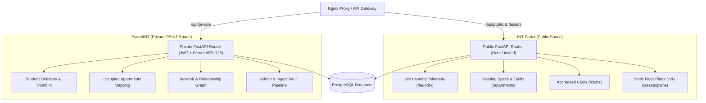

# PalantINT & INT Portal — Technical Architecture & Deep AI Context

Dernière mise à jour : 2026-07-22 (Architecture bicipale, Mermaid Diagram & Separation Public/Privé)

## 👁️ Vision & Architecture à Deux Espaces

Le projet unifie deux applications distinctes partageant un backend FastAPI et une base de données PostgreSQL 16 commune :



## 🏛️ INT Portal (Espace Public)

### Rôle & Vision
Le portail citoyen tout-en-un accessible librement par tous les étudiants, intervenants et visiteurs du campus **IMT-BS / Télécom SudParis** sans aucune authentification requise.

### Design System & Esthétique
* **Palette** : Warm Ivory & Sand (`bg-stone-50` / `bg-stone-900` en mode sombre).
* **Fond dynamique** : Motif pointillé vectoriel discret (`radial-gradient`) superposé à un dégradé doux d'arrière-plan.
* **Header & Shell** : Barre sticky translucide avec logo d'icône `Layers`, basculeur de thème persistent (`ThemeToggle`), et footer minimaliste à filigrane géant `INT PORTAL`.
* **Zero Flash SSR** : Script bloquant synchrone injecté dans le `<head>` de `layout.tsx` empêchant tout clignotement de thème lors du rendu côté serveur.

### Modules Publics Principaux
1. **Accueil (`/`)** : Hero section épurée avec grille éditoriale en 3 colonnes égales (Clubs, Logements, Laverie).
2. **Moniteur de Laverie (`/laundry`)** : Suivi télémetrique en temps réel des machines à laver (mal) et séchoirs (sl) sur les bâtiments U3 à U7 via `/api/laundry/{building}`.
3. **Répertoire du Logement (`/apartments`)** : Catalogue interactif des chambres Maisel (surfaces en m², tarifs de base, calculs boursier/non-boursier, critères PMR) via `/api/students/apartments/details`.
4. **Annuaire des Associations (`/clubs`)** : Répertoire classé par association parente (BDE, BDA, ASINT...) avec tiroir modal de détails et bouclier de protection de la vie privée (`ShieldAlert`).

## 👁️ PalantINT (Espace Privé OSINT)

### Rôle & Vision
Plateforme d'analyse, d'administration et de cartographie haute précision réservée aux opérateurs et administrateurs autorisés.

### Design System & Esthétique
* **Palette** : Luxe Professionnel Brutaliste (Zinc-950, néons sombres, DataGrids haute densité).
* **Interactivité & WebGL** : Jumeau numérique 3D (`BuildingModel`) via Three.js pour le rendu 3D des bâtiments résidentiels. Manipulation directe du DOM (DOM Refs + `setAttribute`) pour les cartes SVG afin de bypasser le cycle React et garantir 60FPS.

### Modules Privés Principaux
1. **Annuaire Etudiant & Trombinoscope** : Recherche globale avec photos de profil (`/students/{id}/image`).
2. **Occupants des Logements (`/palantint/apartments`)** : Cartographie nominative associant chaque numéro de chambre à l'identité de son étudiant occupant (`/students/apartments/occupied`).
3. **Graph & Relations (`/palantint/network`)** : Graphe des liens d'amitié, promo et associations (`StudentRelationship`).
4. **Système de Notifications (`/notifications/laundry/subscribe`)** : Alarmes automatiques de libération de machines réservées aux utilisateurs connectés.
5. **Panneau Administration (`/palantint/admin`)** : Ingestion de données, gestion du Vault et calibrations de cartes (`MapMetadata`).

## 🛡️ Séparation Strictement Imposée Backend (Public / Private)

Le backend FastAPI (`backend/src/main.py`) sépare hermétiquement les deux contextes :

### Routes Publics (`public_router`, pas d'auth)
* **Endpoints** : `/clubs`, `/class-groups`, `/laundry/{building}`, `/students/apartments/details`, `/assets/*`.
* **Garantie** : Protégés par rate-limiting (`rate_limit_dep`). **Aucune PII (Personally Identifiable Information)** n'est retournée. Les listes de membres, photos d'étudiants et informations nominatives en sont strictly exclues.

### Routes Privées (`private_router`, auth requise)
* **Endpoints** : `/private/users/*`, `/private/students/occupied`, `/private/notifications/*`, `/private/admin/*`.
* **Garantie** : Injection obligatoire de la dépendance JWT `require_user_query_token`. Chiffrement symétrique **Fernet (AES-128)** pour le stockage sécurisé des identifiants CAS.

## 🏗️ Architecture Technique & Pipeline ETL

### 🐍 Backend : FastAPI & SQLModel
* **Architecture** : REST API Asynchrone.
* **Modèles** : SQLModel (SQLAlchemy + Pydantic v2) dans `backend/src/db/models.py`.
* **Migrations** : Alembic pour le versioning du schéma PostgreSQL 16.
* **Sécurité** : JWT + Fernet (AES-128).

### ⚛️ Frontend : Next.js 15
* **Moteur** : React 19 + App Router (sous-module Git `INT-Scripts/palantint-frontend`).
* **WebGL** : Three.js pour le rendu 3D des bâtiments résidentiels.
* **Styles** : Tailwind CSS 4. Mode sombre brutaliste sur Zinc-950 pour PalantINT, Warm Ivory & Sand pour INT Portal.

### 🛠️ Scripts & Pipeline ETL (Synchronisation)
* **Harvest (Scrapers)** : Extraient les données brutes (Trombi, Agenda, MiNET) vers JSON dans `data/scraps/`. *Indépendants de la base de données.*
* **Ingest (Loaders)** : Synchronisent les JSON vers PostgreSQL. Gèrent la fusion (Merge) des données web avec les identités locales.
* **Vault (Backup)** : Système de sauvegarde portable dans `data/exports/`. Archive la recherche manuelle (Relations, Socials, Notes) et les calibrations de cartes.
* **TUI** : Interface interactive CLI via `questionary` et `rich`.

## 🗃️ Modèle de Données & Lifecycles

### 1. Hard Infrastructure (Maps)
* **Table** : `MapMetadata`. Coordonnées de calibration 2-Pilliers.
* **Handling** : Source de vérité DB. Exportée vers `maps.json`. Restaurée en premier pour l'ancrage spatial.

### 2. Human Intelligence (OSINT Research)
* **Tables** : `SocialLink`, `StudentRelationship`, `Media` (Comms Log).
* **Handling** : Données créées par l'utilisateur. **Cruciales.** Protégées par le Vault (`data/exports/`). Ne sont jamais écrasées par un scrape automatisé.

### 3. External Subjects (Directory)
* **Tables** : `Student`, `Club`, `StudentClub`.
* **Handling** : Données issues du web. Hydratation (Upsert). Si un sujet disparaît du web, il est marqué `is_active: false` pour préserver ses notes OSINT.

## 📟 Manuel d'Exploitation

### Installation & CLI
```bash
# Dans PalantINT/scripts
uv sync
uv run palantint # Interface interactive TUI
```

### Mandat de Langage
Toute interaction avec l'utilisateur (Web ou CLI) doit utiliser un **Langage Naturel Professionnel**. 
* ❌ "Deploy Operative", "Extraction Velocity", "ID_REF"
* ✅ "Ajouter un membre", "Vitesse de téléchargement", "Identifiant"

## 📂 Structure des Dossiers
* `/backend` : Logique API FastAPI, schémas SQLModel et sécurité.
* `/frontend` : Interface Next.js 15 (Espace Public Portal & Espace Privé PalantINT).
* `/scripts` : Outils de maintenance CLI, scrapers et pipeline ETL.
* `/data/exports` : Le **Vault**. Contient les fichiers JSON de sauvegarde à commiter.
