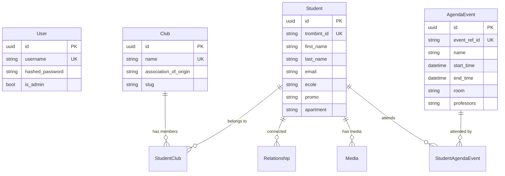

<div align="center">

# 🔮 PalantINT

**Internal OSINT Platform for IMT-BS / Télécom SudParis**

*A classified intelligence interface from the year 2040.*

[](https://github.com/INT-Scripts/palantint-backend)
[](https://github.com/INT-Scripts/palantint-frontend)
[](https://github.com/INT-Scripts/palantint-scripts)
[](https://www.postgresql.org/)

</div>

---

## 👁️ What is PalantINT?

PalantINT unifies disparate campus data sources — student directories, timetables, club listings, and residential maps — into a single, immersive intelligence interface.

Built with a **Dark Luxury / Intelligence Agency** aesthetic: glassmorphism on abyssal zinc backgrounds, brutalist typography, and thermal-radar building maps.

### Key Features

| Feature | Description |
|---------|-------------|
| 🕵️ **Student Profiles** | Aggregated dossiers with photos, schedules, relationships, and media |
| 🗺️ **Thermal Radar** | Interactive SVG building plans with room-level resident lookup |
| 📅 **Agenda Intel** | Timetable cross-referencing across students and rooms |
| 🏛️ **Club Directory** | BDE/BDA/ASINT club listings with member rosters |
| 🔗 **Social Graph** | Relationship mapping (friends, couples, ex) between students |
| 📸 **Media Gallery** | Per-student image/video/note attachments |

---

## 🏗️ Architecture

```
PalantINT/                    ← You are here (orchestrator)
├── backend/                  ← 🐍 FastAPI REST API        [submodule]
├── frontend/                 ← ⚛️  Next.js 15 App Router   [submodule]
├── scripts/                  ← 🛠️ OSINT Pipeline & Tools   [submodule]
├── data/                     ← 📦 Persistent volume (assets, scraps)
├── compose.yaml              ← 🐳 Docker Compose (base)
├── compose.override.yaml     ← 🔄 Dev overrides (hot-reload)
├── compose.prod.yaml         ← 🚀 Production overrides
└── nginx.conf                ← 🌐 Reverse proxy config
```

Each component lives in its own Git repository, linked here as **submodules**:

| Component | Repository | Tech Stack |
|-----------|-----------|------------|
| **Backend** | [`INT-Scripts/palantint-backend`](https://github.com/INT-Scripts/palantint-backend) | FastAPI · SQLModel · PostgreSQL · JWT · Bcrypt |
| **Frontend** | [`INT-Scripts/palantint-frontend`](https://github.com/INT-Scripts/palantint-frontend) | Next.js 15 · React 19 · Tailwind CSS 4 · Shadcn UI |
| **Scripts** | [`INT-Scripts/palantint-scripts`](https://github.com/INT-Scripts/palantint-scripts) | Rich TUI · HTTPX · BeautifulSoup · OpenCV |

---

## 🚀 Getting Started

### Prerequisites

- [Docker](https://docs.docker.com/get-docker/) & [Docker Compose](https://docs.docker.com/compose/)
- [Git](https://git-scm.com/) (for submodule cloning)

### Clone

```bash
git clone --recurse-submodules https://github.com/INT-Scripts/PalantINT.git
cd PalantINT
```

> Already cloned without submodules? Run: `git submodule update --init --recursive`

### Development (Hot-Reload)

```bash
docker compose up --watch
```

The app is served at **http://localhost** via an Nginx reverse proxy:
- **Frontend**: Proxied from port `3000`
- **Backend API**: Available at `/api/*`
- **Static Assets**: Served from `/api/assets/*`

### Production

```bash
docker compose -f compose.yaml -f compose.prod.yaml up --build
```

Uses optimized Dockerfiles: the frontend is statically exported and served by Nginx, the backend runs multi-worker Uvicorn.

---

## 🛠️ Data Pipeline

The **scripts** submodule contains a Rich TUI pipeline for scraping and synchronizing all data sources.

```bash
cd scripts/
uv sync                        # Install dependencies
uv run palantint-scrape         # Launch the full pipeline
uv run palantint-scrape --purge # Wipe DB first, then scrape
```

#### Pipeline Steps

| Step | Description | Requires CAS? |
|------|-------------|:-:|
| Purge Database | Drop & recreate all tables | ❌ |
| Seed Relationships | Insert default types (Amis, En couple, Ex) | ❌ |
| Scrape Clubs | Fetch BDE/BDA/ASINT listings | ❌ |
| Scrape TrombINT | Download student directory | ✅ |
| Backfill Students | Enrich with école/filière data | ✅ |
| Import Agenda | Ingest timetable JSON scraps | ❌ |
| Fix Missing Images | Re-download missing profile photos | ✅ |

CAS-dependent steps require `CAS_USERNAME` and `CAS_PASSWORD` environment variables.

### Other CLI Tools

```bash
uv run palantint-admin <user> <pass>   # Create an admin account
uv run palantint-svg                    # Process building SVG plans
```

---

## 🔐 Admin Setup

After the database is populated, create your first admin user:

```bash
cd scripts/
uv run palantint-admin admin yourpassword
```

Then navigate to **http://localhost/login** to authenticate.

---

## 📦 Transferring Data

The database and `data/` directory are **not** stored in Git (they're gitignored). To transfer a working instance to someone else, use the portability script:

### On your machine (sender)

```bash
# Make sure the DB container is running
docker compose up -d db

# Export everything into a single archive
./portability.sh save
```

This creates a `palantint-transfer-YYYYMMDD-HHMMSS.tar.gz` containing:
- **PostgreSQL dump** — full schema + all data
- **`data/assets/profiles/`** — student photos
- **`data/assets/plans/`** — processed SVG building maps
- **`data/assets/media/`** — user-uploaded content
- **`data/scraps/`** — raw JSON scraps, input SVGs

### On the other machine (receiver)

```bash
# Clone the repo
git clone --recurse-submodules https://github.com/INT-Scripts/PalantINT.git
cd PalantINT

# Place the archive here, then import
./portability.sh load palantint-transfer-*.tar.gz

# Start everything
docker compose up --watch
```

---

## 🗂️ Data Model



---

## 🤝 Contributing

1. Fork the relevant submodule repository
2. Create your feature branch (`git checkout -b feat/amazing-feature`)
3. Commit your changes (`git commit -m 'feat: add amazing feature'`)
4. Push to the branch (`git push origin feat/amazing-feature`)
5. Open a Pull Request

### Working with Submodules

```bash
# Pull latest changes (including submodule updates)
git pull
git submodule update --remote --merge

# After committing inside a submodule, update the root reference
cd ..
git add backend  # or frontend, scripts
git commit -m "chore: update backend submodule ref"
git push
```

---

## 📜 License

This project is private and intended for internal use within the INT-Scripts organization.

---

<div align="center">
<sub>Built with 🖤 by the PalantINT Team — <i>"Rien n'échappe au Palantír."</i></sub>
</div>
