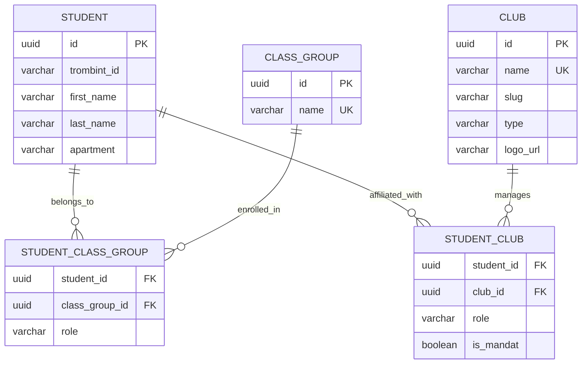

# Academic Class Groups & Extracurricular Organizations Segregation

This document outlines the architecture, database schema, data ingestion pipelines, backend APIs, and frontend updates implemented to decouple **Academic Class Groups** (cohorots/promos) from **Extracurricular Student Organizations** (clubs/associations).

---

## 1. Architectural Motivation

Previously, academic classes (e.g., `CL_FI_EI1`) and extracurricular clubs/associations (e.g., `BDE`, `Club Photo`) were stored in the same `Club` table with a custom discriminator field (`type="Classe"`). This unified representation caused several issues:
1. **Semantic Inaccuracy**: An academic registration group behaves differently from an elective club.
2. **Branding and Feature Creep**: Clubs have distinct high-fidelity styling, branding, and logos. Treating class groups as clubs forced them to either adopt fake logo assets or break standard views.
3. **Complex Frontend Logic**: The client was required to manually perform `.filter` checks on the club records to render classes in an "Academic Path" panel and standard clubs in an "Affiliations" panel.
4. **Poor Extensibility**: Future class-specific attributes (e.g., academic year, tutor, level, department) or club-specific attributes (e.g., budget, office, constitution) could not be modeled cleanly.

By segregating these entities, both schemas are now fully decoupled, resulting in a cleaner API contract, simplified UI code, and direct relational mappings.

---

## 2. Database Schema

The refactored database layout isolates academic entities into two dedicated tables:

### `ClassGroup`
Stores the metadata for a unique academic cohort or registration group.
* **`id`**: `UUID` (Primary Key, auto-generated)
* **`name`**: `VARCHAR` (Unique, indexed; e.g. `CL_FI_EI1`)

### `StudentClassGroup` (Junction Table)
Establishes the many-to-many relationship between students and class groups.
* **`student_id`**: `UUID` (Foreign Key -> `Student.id`, Primary Key)
* **`class_group_id`**: `UUID` (Foreign Key -> `ClassGroup.id`, Primary Key)
* **`role`**: `VARCHAR` (Default: `"STUDENT"`; allows custom assignments like class representative)

---

## 3. Data Ingest & Loader Pipeline

The loader script (`scripts/src/palantint_scripts/loaders/groupes.py`) has been refactored to populate the new class tables independently of clubs:
* Identifies group memberships from scraped Annuaire JSON topologies.
* Upserts class identities directly into the `ClassGroup` table.
* Re-associates students using `StudentClassGroup` instead of adding them as club members with `"Classe"` metadata.
* Filters out all academic data from standard `Club` insertions to keep the club directory clean.

---

## 4. Backend REST APIs

### Dedicated Class Groups Router (`api_class_groups.py`)
Registered at `/class-groups`, providing endpoints for class-specific operations:
* `GET /class-groups`: Returns a list of all class groups in the directory.
* `GET /class-groups/{id}`: Returns the full details of a specific academic cohort, along with a serialized roster of its members.

### Updated Student Profile (`api_students.py`)
The student profile detail API has been updated to explicitly fetch and return separated fields in the JSON response:
* **`clubs`**: Standard extracurricular organizations.
* **`class_groups`**: Academic class memberships mapped through `StudentClassGroup`.

### Refactored Search Routing (`api_search.py`)
The global query search endpoint now splits database results into distinct buckets:
* **`students`**: Matched student profiles.
* **`clubs`**: Real extracurricular organizations.
* **`class_groups`**: Matches on academic class entities.
* **`apartments`**: Resident mappings.

---

## 5. Frontend & UI Segregation

### Client-Side Decoupling (`SocialsClubsSidebar.tsx`)
* Removed the legacy `type !== 'Classe'` filter hack.
* Uses direct, decoupled states: `student.clubs` for organizational linkages and `student.class_groups` for the student's academic profile.
* Links academic cohorts to the newly deployed dedicated class route.

### High-Fidelity Class Detail View (`/class-groups/[id]/page.tsx`)
A dedicated, premium dashboard built to display class rosters:
* Dark-themed glassmorphism layout, prioritizing performance and user experience.
* Interactive directory grid showing avatar, student status, promo levels, and affiliations.
* Fully integrated search results dropdown supporting instant navigation to specific classes.
